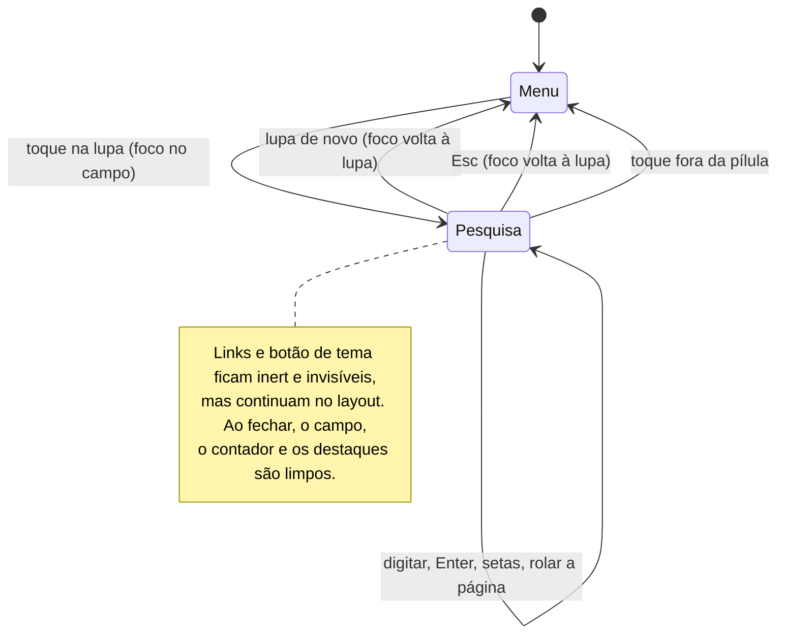

# Acessibilidade e interação

## 1. Estrutura

- **I1. Toda página DEVE ter:**
  - `lang="pt-BR"`;
  - um link "Pular para o conteúdo" (`.skip`, que aparece com o foco) apontando para `#conteudo`;
  - um `<main id="conteudo">`;
  - títulos em ordem (`h1` único; `h2` nas seções);
  - `aria-labelledby` nas seções com título.
- **I2. Ícones decorativos DEVEM ter `aria-hidden="true"`.** Um botão só com ícone DEVE ter `aria-label` em pt-BR.
- **I3. Sem JavaScript, a página DEVE mostrar um `<noscript>` explicando que o app precisa de JS.**
  *Por quê:* desde o PR #4, a página é um app React.

## 2. Menu

| Recurso | Implementação |
|---|---|
| Rótulo | `<nav aria-label="Seções desta página">` |
| Item atual | `aria-current="location"` no link da seção atual. A pílula de seleção é `aria-hidden` |
| Scroll-spy | o item atual é a última seção cujo topo passou da linha "base do menu + 32px". No fim da página, a última seção vence |
| Toque num link de seção | seleciona na hora e pausa o spy por 700 ms. Enquanto a página rola, o prazo se renova por 220 ms |
| Foco por teclado | `onFocus` rola o link para dentro da barra, com 12px de folga, sem rolar a página |
| Rolagem lateral | toque e trackpad nativos. **Shift + roda** é tratado em JS (listener `passive: false`), porque WebKit e Gecko nem sempre fazem isso |
| Conteúdo | só as seções da página (DESIGN D12). As outras páginas ficam na lista ☰ |
| Botão ☰ | o primeiro item da pílula, em toda página: `<button aria-expanded aria-controls aria-label="Abrir lista de páginas">` ("Fechar lista de páginas" quando aberta). No modo pesquisa fica `inert` e oculto. Não há botão Início: o Início é um item da lista |
| Lista de páginas | `<nav aria-label="Páginas do site">` com uma `<ul>` de links. A página atual tem `aria-current="page"` e um ✓ (não só cor). Ao abrir, o foco vai para ela; ↑/↓, Home e End andam entre os itens; Esc fecha e devolve o foco ao ☰; um toque fora, a escolha de uma página, o ☰ de novo ou o foco saindo dela também fecham. Anel de foco neutro, nunca azul |

- **I4. O item atual DEVE ser comunicado por `aria-current`, e não só pela cor ou pela pílula.**
- **I5. O item com foco ou selecionado DEVE ficar sempre visível dentro da barra.**
  *Por quê:* sem isso, a navegação por teclado cairia em links ocultos.

## 3. Pesquisa

### Abrir e fechar

| Ação | Resultado |
|---|---|
| Toque ou clique na lupa | abre. O campo recebe o foco dentro do gesto (`flushSync`), para o iOS abrir o teclado |
| Lupa de novo | fecha e devolve o foco à lupa |
| `Esc` (no campo ou em qualquer lugar) | fecha e devolve o foco à lupa. No campo, `stopPropagation` evita que a tecla seja tratada duas vezes |
| Clique ou toque fora da pílula | fecha **sem** mexer no foco |
| Rolar a página | **não** fecha, para ser possível ler os resultados |
| Fechar, de qualquer forma | limpa o campo, o contador e todos os destaques |

### ARIA

- Lupa:
  - `aria-expanded` com `true` ou `false`;
  - `aria-controls` apontando para o id do formulário;
  - `aria-label` e `title` que alternam entre "Pesquisar na página" e "Fechar pesquisa".
- Formulário: `role="search"`, `aria-label="Pesquisar na página"`, e `inert` quando fechado.
- Menu no modo pesquisa: os links e o botão de tema ficam `inert` (fora da ordem de tabulação e da árvore de acessibilidade), mas continuam no layout.
- Contador: `<output htmlFor={input} aria-live="polite">`, com "N de M", "Nenhum resultado" ou vazio (menos de 2 caracteres).
- Botões:
  - "Limpar pesquisa" só aparece quando há texto;
  - "Resultado anterior" e "Próximo resultado" ficam `disabled` quando há menos de 2 ocorrências.
- Campo: `type="search"`, `enterKeyHint="search"`, `autoComplete="off"`, `autoCapitalize="off"`, `spellCheck={false}`.

### Teclas no campo

`Enter` vai para a próxima ocorrência. `Shift+Enter` vai para a anterior. Se o texto mudou desde a última busca, a busca é refeita primeiro.

### Algoritmo

1. **Escopo:** os nós de texto de `#conteudo`, percorridos com `TreeWalker(SHOW_TEXT)`. Ficam de fora:
   - texto vazio;
   - nós dentro de `script, style, noscript, svg, [aria-hidden=true], [hidden], [data-search-skip]`;
   - nós que não são renderizados (`getClientRects().length === 0`).
2. **Normalização:** cada caractere passa por `normalize("NFD")`, perde os diacríticos (`/[\u0300-\u036f]/g`) e vai para minúsculas. Um mapa de índices leva cada posição normalizada de volta ao texto original. Com isso, "acucar" encontra "Açúcar", e "LÍQUIDO" encontra "líquido".
3. **Busca:** `indexOf` sem sobreposição em cada nó. Cada ocorrência vira um `Range` sobre o nó original.
4. **Disparo:** mínimo de 2 caracteres e debounce de 160 ms enquanto se digita.
5. **Navegação:** a ocorrência atual é centralizada em ~40% da altura da tela (`scrollTo`, com `smooth`, ou `auto` se houver movimento reduzido). O índice dá a volta nas pontas.
6. **Destaque:**
   - Se `CSS.highlights` e `Highlight` existem, dois highlights: `page-search` (todas as ocorrências) e `page-search-current` (a atual), estilizados com `::highlight()`.
   - **Senão (fallback),** caixas absolutas (`.ps-overlay`) desenhadas por um portal em `body` a partir de `range.getClientRects()`, recalculadas no `resize`.

- **I6. A pesquisa NÃO DEVE alterar o DOM do conteúdo.** `<mark>` é proibido.
  *Por quê:* o React é dono dos nós de texto. Dividi-los com `<mark>` quebra a reconciliação (a próxima renderização pode perder ou duplicar texto). A Highlight API não toca no DOM, e o fallback desenha por cima.
- **I7. A pesquisa DEVE ignorar acentos e maiúsculas.**
  *Por quê:* o conteúdo é em pt-BR, e o usuário digita sem acento no celular.
- **I8. Ao sair do componente,** os highlights DEVEM ser removidos (`CSS.highlights.delete`).

## 4. Foco visível

| Onde | Estilo |
|---|---|
| Global | `:focus-visible { outline: 2px solid var(--focus); outline-offset: 3px; border-radius: 10px }`, com `--focus` neutro e translúcido: `rgba(28,28,30,.5)` no claro, `rgba(245,245,247,.62)` no escuro (era `#0a84ff` até o PR #14) |
| Links do menu, itens da lista ☰ e botões ☰, tema e lupa | `outline: 1.5px solid var(--bar-sub); outline-offset: -1.5px` |
| Chips da galeria e barra de abas do painel | o mesmo aro interno `--bar-sub`; num chip marcado, somado a `--sel-shadow` |
| Controle segmentado, switch e slider do painel, cartões e foto da lupa da galeria | `outline` com `var(--focus)` (2px; 3px nos cartões e na foto). No switch e no slider o anel vai no elemento visível depois do `<input>` (`input:focus-visible + *`) |
| Botões sobre a foto do visor | `outline: 2px solid var(--focus-on-photo)` (`rgba(255,255,255,.85)`) |
| **Pílula e campo no modo pesquisa** | **nenhum** (`outline: none`). O cursor (`caret-color: var(--bar-text)`, neutro) mostra o foco, e a pílula aberta já indica a pesquisa |

- **I9. Todo controle interativo DEVE ter anel de `:focus-visible`,** exceto a pílula e o campo no modo pesquisa (DESIGN D17). **O anel NUNCA é azul** (DESIGN D31 e N10).
  *Por quê:* o foco por teclado precisa ser visível. A exceção é um pedido de design, e o foco continua evidente pelo cursor dentro do campo aberto. A cor neutra também é pedido de design (PR #15). No teste do PR #15, Tab por todas as páginas, nos dois temas, no Chromium e no WebKit: 703 elementos focados, todos com anel, nenhum azul.

## 5. Preferências do sistema

| Preferência | Efeito |
|---|---|
| `prefers-reduced-motion: reduce` | Sem órbita da lente (fica em `REST`). Sem transições no menu, no indicador e na pesquisa (a troca é instantânea). `scroll-behavior: auto`. A rolagem da pesquisa e do menu usa `behavior: "auto"` |
| `prefers-reduced-transparency: reduce` | Tintas quase opacas (`.95`–`.96`), `.gcard-body` com `rgba(255,255,255,.94)`. O vidro do menu e da lista ☰ não muda: as tintas vêm de `vidro.ini` |
| `prefers-color-scheme` | Tema padrão enquanto o usuário não escolhe. As mudanças do sistema são seguidas até haver escolha salva |
| `(hover: none)` | A dica do hero diz "Toque no título para guiar a lente." (senão, "Mova o cursor…") |

- **I10. Movimento e transparência reduzidos DEVEM ser respeitados em todo componente novo.** No painel, a lente do segmentado pula direto para a opção (sem mola). Na galeria, a apresentação começa pausada e sem zoom lento.

## 6. Componentes das páginas de exemplo (PR #12)

| Componente | Papel e rótulos | Teclado |
|---|---|---|
| Segmentado do painel ("Hora do dia") | `role="radiogroup"` com `aria-label`; cada opção é `role="radio"` com `aria-checked`; só a marcada tem `tabIndex=0` (roving tabindex) | setas ← → ↑ ↓ trocam a opção e movem o foco |
| Chave e controle deslizante (examples/ do fork) | `role="switch"` / `input type="range"` da receita, com `aria-label` em pt-BR ("Widgets na tela", "Brilho do papel de parede"); o valor aparece num `<output aria-live="polite">` | Espaço / setas, como na receita |
| Barra de abas do painel | `<nav aria-label="Seções do painel (barra de abas)">`, links `#âncora`, `aria-current="location"` na aba atual; `data-search-skip` | Tab entre as abas; o spy segue a rolagem |
| Visor da galeria | botões "Foto anterior", "Pausar/Reproduzir a apresentação" (`aria-pressed`), "Próxima foto"; contador "N de 9" em `aria-live="polite"`; o canvas e os discos são `aria-hidden` | ← → trocam a foto quando o foco está no visor |
| Chips da coleção | `role="toolbar"` com `aria-label="Filtrar a coleção"`; cada chip é um botão com `aria-pressed`; a contagem é `aria-live` | Tab |
| Folha da galeria | `<dialog>` modal (`showModal`), `aria-labelledby` no título; o foco vai para "Fechar" ao abrir e volta para a foto da grade ao fechar; toque fora da folha fecha | `Esc` fecha |
| Lupa da folha | a foto é focável, com `aria-label` "Foto com lupa: arraste ou use as setas para mover a lupa" | setas movem a lupa (4% por toque; 10% com Shift), no mesmo caminho do arrasto: um ref e um quadro, sem render |
| Documentos nas páginas de contrato | cada documento é um `article` com `aria-labelledby` no título; tabelas e blocos de código são regiões roláveis com `tabindex="0"`; o índice de chips é `data-search-skip` | Tab entra na tabela ou no código para rolar com as setas |

## 7. Toque

- `-webkit-tap-highlight-color: transparent` nos links e botões do menu.
- Na lente, um toque posiciona e a segura por 1,6 s; o `pointercancel` solta na hora.
- O zoom da página é travado (veja [TELA-CHEIA-E-BARRAS.md](TELA-CHEIA-E-BARRAS.md) T2).
