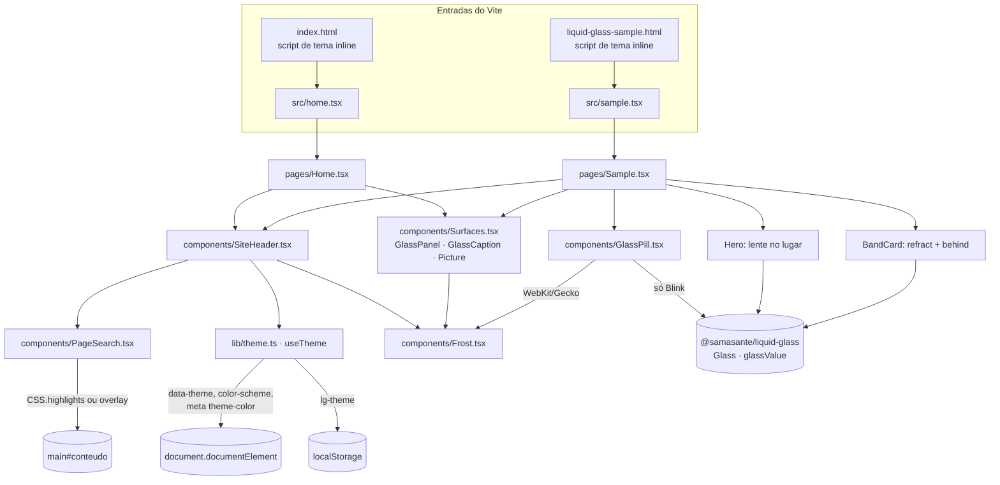

# Arquitetura

> Estado descrito: `main` em `aab3bc1` (merge do PR #9). As versões vêm de `package.json` e `pnpm-lock.yaml`.

## 1. Stack

| Camada | Pacote | Especificador (`package.json`) | Versão resolvida (`pnpm-lock.yaml`) |
|---|---|---|---|
| UI | `react` | `^19.2.0` | **19.3.0** |
| UI | `react-dom` | `^19.2.0` | **19.3.0** |
| Vidro | `@samasante/liquid-glass` | `0.1.1` (exato) | **0.1.1** |
| Build | `vite` | `^8.0.0` | **8.3.1** |
| Build | `@vitejs/plugin-react` | `^6.0.0` | **6.1.1** |
| Tipos | `typescript` | `^5.7.0` | **5.9.3** |
| Tipos | `@types/react` / `@types/react-dom` | `^19.2.0` | **19.3.0** / **19.3.0** |
| Gerenciador | pnpm | `"packageManager": "pnpm@10.28.2"` | lockfile `lockfileVersion: '9.0'` |
| Runtime de build | Node | workflow: `node-version: 22` | o Vite 8.3.1 exige `^20.19.0 \|\| >=22.12.0` |

**Regras**

- **A1. O projeto DEVE usar Vite + `@vitejs/plugin-react`, React 19 e TypeScript em modo `strict`.**
  *Por quê:* é a mesma stack do site de demonstração do fork (`site/package.json`, `site/vite.config.ts`). O PR #4 trocou o HTML estático com script caseiro por essa stack, porque é assim que a biblioteca orienta o uso.
- **A2. O projeto DEVE usar pnpm com a versão fixada em `packageManager` e instalar com `--frozen-lockfile` no CI.**
  *Por quê:* o lockfile fixa o hash de integridade do pacote de vidro (`sha512-i4cQzl…`), e o `pnpm/action-setup@v4` lê a versão desse campo.
- **A3. A dependência de vidro DEVE ter versão exata** (`"0.1.1"`, sem `^`).
  *Por quê:* o visual depende de detalhes internos da biblioteca, como `edgeShadow`, `MATERIAL_OPTICS` e a detecção de Blink. Uma versão menor nova pode mudar esses detalhes.
- **A4. Tailwind e outros frameworks de CSS NÃO DEVEM ser adicionados.**
  *Por quê:* o `site/` do fork usa Tailwind só "for the SITE only", e a biblioteca "works with any CSS". Aqui o CSS é simples, com um arquivo por componente ou página.

`tsconfig.json`: `target`/`lib` ES2020 + DOM, `moduleResolution: "bundler"`, `jsx: "react-jsx"`, `strict: true`, `noEmit: true`, `types: ["vite/client"]`, `include: ["src"]`. A pasta `docs/` fica fora do typecheck e do build.

## 2. Estrutura de pastas

```text
HTML/
├── .github/workflows/pages.yml   # build + deploy no GitHub Pages (Actions)
├── docs/                         # este contrato (não entra no build)
├── index.html                    # entrada do Vite: página inicial
├── liquid-glass-sample.html      # entrada do Vite: amostra
├── package.json / pnpm-lock.yaml
├── tsconfig.json
├── vite.config.ts                # base /HTML/, duas entradas, portas 4178/4179
├── public/                       # copiado como está para dist/
│   └── img/
│       ├── CREDITS.md            # autor, licença e fonte de cada foto
│       ├── *.jpg                 # 6 originais (1600 px de largura, fallback)
│       └── r/                    # 48 variantes: {nome}-{480,720,1080,1440}.{avif,webp}
├── scripts/
│   └── make-responsive-images.py # gera public/img/r/ a partir dos JPEG
└── src/
    ├── home.tsx                  # monta <Home/> em #root
    ├── sample.tsx                # monta <Sample/> em #root
    ├── components/
    │   ├── SiteHeader.tsx/.css   # menu flutuante (links, indicador, tema, lupa)
    │   ├── PageSearch.tsx/.css   # pesquisa dentro da pílula (Highlight API + fallback)
    │   ├── Frost.tsx             # superfície fosca em CSS puro (blur + saturate)
    │   ├── GlassPill.tsx         # botão de vidro: <Glass> no Blink, <Frost> nos demais
    │   └── Surfaces.tsx          # GlassPanel, GlassCaption, Picture, asset() e URLs
    ├── lib/
    │   ├── optics.ts             # óticas CONTROL, FROST e PANEL (todas com specular: 0)
    │   ├── theme.ts              # useTheme, applyTheme, THEME_KEY, PAGE_EDGE
    │   └── useMedia.ts           # useMediaQuery, useReducedMotion
    ├── pages/
    │   ├── Home.tsx/.css         # feed de cartões e fotos
    │   └── Sample.tsx/.css       # lente do título, cartões refract, fotos, notas
    └── styles/
        └── global.css            # fundo, hairline, tintas, foco, variáveis
```

## 3. Entradas do Vite e `base`

`vite.config.ts`:

```ts
export default defineConfig({
  base: "/HTML/",                                   // site de projeto do GitHub Pages
  plugins: [react()],
  resolve: { dedupe: ["react", "react-dom"] },
  build: {
    rollupOptions: {
      input: {
        index: entry("./index.html"),
        sample: entry("./liquid-glass-sample.html"),
      },
    },
  },
  server: { host: "127.0.0.1", port: 4178 },
  preview: { host: "127.0.0.1", port: 4179 },
});
```

- **A5. Cada página DEVE ser uma entrada HTML própria em `rollupOptions.input`.** NÃO DEVE haver roteador no cliente.
  *Por quê:* as URLs públicas (`/HTML/`, `/HTML/index.html`, `/HTML/liquid-glass-sample.html`) existiam antes do React e continuaram iguais no PR #4. Com uma entrada por página, cada uma carrega só o JS de que precisa (veja [DESEMPENHO.md](DESEMPENHO.md)).
- **A6. `base` DEVE ser o caminho do repositório** (`/HTML/`), e todo caminho de asset em runtime DEVE passar por `import.meta.env.BASE_URL`, via `asset()` em `Surfaces.tsx`:

  ```ts
  export const asset = (path: string) => `${import.meta.env.BASE_URL}${path}`;
  export const HOME_URL = import.meta.env.BASE_URL;
  export const SAMPLE_URL = `${import.meta.env.BASE_URL}liquid-glass-sample.html`;
  export const CREDITS_URL = `${import.meta.env.BASE_URL}img/CREDITS.md`;
  ```

  *Por quê:* um site de projeto no Pages fica em `/<repo>/`. Um caminho absoluto `/img/...` daria 404.
- **A7. `resolve.dedupe: ["react", "react-dom"]` DEVE ser mantido.**
  *Por quê:* a biblioteca declara React como `peerDependency` (`>=18`). O dedupe garante uma cópia só de React no bundle.

Cada HTML de entrada tem, no `<head>`, um script inline de tema e um `<style>` inline com a cor de fundo. Os dois rodam antes do bundle (veja [TELA-CHEIA-E-BARRAS.md](TELA-CHEIA-E-BARRAS.md)). O `<body>` tem só `<div id="root">`, um `<noscript>` em pt-BR e `<script type="module" src="/src/{home,sample}.tsx">`.

**Chunks gerados** (`pnpm build` em `aab3bc1`):

| Arquivo | Bruto | gzip | Conteúdo |
|---|---|---|---|
| `assets/Surfaces-*.js` | 233,28 kB | 73,44 kB | compartilhado: React, react-dom, SiteHeader, PageSearch, Frost, Surfaces e tema |
| `assets/index-*.js` | 5,88 kB | 2,35 kB | página inicial |
| `assets/sample-*.js` | 62,38 kB | 20,65 kB | amostra, **incluindo `@samasante/liquid-glass`** |
| `assets/Surfaces-*.css` | 11,24 kB | 3,36 kB | `global.css`, `SiteHeader.css` e `PageSearch.css` |
| `assets/index-*.css` | 1,80 kB | 0,76 kB | `Home.css` |
| `assets/sample-*.css` | 4,65 kB | 1,57 kB | `Sample.css` |

## 4. Componentes e fluxo de dados



### 4.1 `SiteHeader` (menu flutuante)

As props são `items: NavItem[]`, `label = "Principal"` e `searchScope = "conteudo"`. Cada página passa a própria lista `NAV`:

| Página | Itens |
|---|---|
| Início | Início (`#topo`), Amostra (link de página), Menu, Busca, Gradiente, Cartões, Céu noturno, Créditos |
| Amostra | ‹ Início (`back: true`, `aria-label="Voltar ao início"`), Lente (`#topo`), Componentes, Lugares, Suporte, Créditos |

Estado interno:

| Estado | Para quê |
|---|---|
| `searchOpen` | alterna `data-mode="menu" \| "search"` na pílula |
| `active` | índice da seção atual (scroll-spy) → `aria-current="location"` |
| `indicator {x, w}` e `animate` | posição e largura da pílula de seleção; não anima na primeira colocação |
| `fade {start, end}` | degradê só no lado em que há mais links |
| `pinned` (ref) | depois de um toque em um link, pausa o scroll-spy por 700 ms. O prazo se renova por 220 ms enquanto a página rola, para a seleção não voltar no meio da rolagem |

Os detalhes de interação estão em [ACESSIBILIDADE-E-INTERACAO.md](ACESSIBILIDADE-E-INTERACAO.md).

### 4.2 `PageSearch` (pesquisa)

`PageSearch` fica sempre montado dentro da pílula e recebe `open`. Com `open = false`, ele fica `inert` e invisível. Ele procura nos nós de texto de `#conteudo` (o `<main>` das duas páginas).

- A busca começa a partir de 2 caracteres, com debounce de 160 ms.
- As ocorrências são destacadas com a CSS Custom Highlight API. Onde ela não existe, caixas são desenhadas por cima do texto (portal em `body`).
- O rodapé da amostra (`footer#creditos`) está **fora** do `<main>` e, por isso, não entra na pesquisa.

### 4.3 Tema

`lib/theme.ts` exporta `useTheme()`, que devolve `{ theme, toggle }`, e também `applyTheme(t)`, `THEME_KEY = "lg-theme"` e `PAGE_EDGE = { light: "#8b82e6", dark: "#1b1646" }`.

O estado inicial vem de `<html data-theme>`, já definido pelo script inline. Enquanto não há escolha salva, o tema acompanha `prefers-color-scheme`. O `toggle` salva a escolha em `localStorage` e aplica `data-theme`, `style.colorScheme` e `meta[name=theme-color]`.

### 4.4 Páginas

- **`Home`:** um link "Pular para o conteúdo", o `SiteHeader` e `<main class="feed" id="conteudo">`. Dentro do `main` ficam um `GlassPanel` de introdução, seis `Card` (que são `GlassPanel`), três `Photo` (`Picture` + `GlassCaption`) e o rodapé em `GlassPanel`.
- **`Sample`:**
  - um `Hero` com a lente no lugar e duas `GlassPill`;
  - a seção de componentes, com três `BandCard` sobre `.band` e três `GlassPill`;
  - a seção de lugares, com três `Place` (`Picture` + `GlassCaption`);
  - a seção de suporte, com quatro `Note` (`GlassPanel`);
  - o rodapé em `GlassPanel`.

### 4.5 A lente do título (`Hero`)

- **Modo:** lente **no lugar** (`size` + `center` + filhos), o mesmo padrão do `LiveHero` em `site/src/views/Docs.tsx` do fork. A ótica é `HERO_LENS` (baseada na do docs, com `specular: 0`).
- **Palco:** `.hero-stage`, do tamanho do bloco do título, **não** do hero inteiro. Ele vai de `76px + safe-top` até `132px + safe-bottom`, com largura máxima de 1100 px.
- **Tamanho da lente:** `round(clamp(130, 0.42 × largura do palco, 200))` px, com `radius = size / 2`.
- **Posição:** o centro é um par de `glassValue` (`x`, `y`) em frações do palco.
  - Em repouso: `{0.3, 0.42}`.
  - Órbita: centro (0.5, 0.5), raios 0.26 × 0.14, velocidade 0.5 rad/s.
  - O centro fica preso para o disco caber inteiro no palco (como o `clampBox` do `GlassDemo`).
- **Correção do oval:** `scaleX = s·min(w,h)/w` e `scaleY = s·min(w,h)/h`.
- **Hairline:** um `.hero-ring`, que acompanha `x`/`y` pelos eventos `change`, desenha a linha uniforme sobre a lente.
- **Loop de animação:** `requestAnimationFrame`, pausado quando o hero sai da tela (IntersectionObserver) ou a aba fica oculta (`visibilitychange`).
- **Ponteiro:**
  - o mouse move a lente;
  - um toque posiciona a lente e a segura por 1,6 s;
  - ao rolar com o mouse parado, a lente volta a mirar o cursor.

### 4.6 Cartões `refract` (`BandCard`)

Mesmo padrão de `examples/GlassNotification.tsx` do fork.

- Um `<Glass refract={cópia} behind={--band-edge}>` com `width`, `height` e `radius` medidos (ResizeObserver no cartão e na faixa).
- A cópia é um `div` com `background: var(--band-bg)`, deslocado por `-left` e `-top` para ficar alinhado com a faixa real.
- A ótica é `PANEL_LENS` (`mapSize: 256`, `strength: 0.17`, `specular: 0`…) com `brightnessInFilter`.
- O conteúdo nítido fica por cima, em `.gcard-body`.

## 5. Como a biblioteca é consumida

- **A8. A biblioteca DEVE vir do npm** (`"@samasante/liquid-glass": "0.1.1"`).
  - **NÃO DEVE** vir como dependência GitHub (`github:romastefale/liquid-glass`).
  - **NÃO DEVE** vir como bundle vendorizado em `assets/`.

  *Por quê:*
  - O fork **não versiona `dist/`** (está no `.gitignore`) e não tem script `prepare`. Instalado via GitHub, o pacote viria vazio.
  - O `dist/` publicado no npm é **byte a byte idêntico** ao build do fork em `4e7b769`. Foi conferido no PR #4 e de novo ao escrever este documento: `cmp` de `dist/index.js` e `dist/index.d.ts` depois de `pnpm build` no fork. Ou seja, é o código do fork, com integridade fixada pelo lockfile.
  - O bundle vendorizado (PRs #1–#3) foi removido no PR #4.
- **A9. Só a API pública DEVE ser importada:** `Glass`, `glassValue` e o tipo `GlassOptics`.
  - Arquivos fora de `src/pages/Sample.tsx` e `src/components/GlassPill.tsx` **só podem importar tipos** (`import type`). É o caso de `lib/optics.ts`, `components/Frost.tsx` e `components/Surfaces.tsx`.

  *Por quê:* `import type` é apagado na compilação, e isso mantém a biblioteca fora do chunk da página inicial (PR #9).

### Modos da biblioteca usados

| Modo (README do fork) | Como se ativa | Onde é usado aqui |
|---|---|---|
| **Material** (a caixa translúcida vira vidro) | `<Glass>` sem geometria | `GlassPill` **só no Blink** (5 botões na amostra) |
| **No lugar** (a lente dobra os próprios filhos) | `size` + `center` + filhos | a lente do título da amostra |
| **Cópia** (`refract` + `behind`) | `refract={nó}` e `behind={cor}` | os 3 cartões da faixa da amostra |

## 6. Onde há `<Glass>` e onde há fosco em CSS

| Superfície | Componente | Implementação | Ótica / valores | Página |
|---|---|---|---|---|
| Pílula do menu | `SiteHeader` | `<Frost>` + `.tint-bar` | `FROST`: `blur(6px) saturate(1.15)` | ambas |
| Botões redondos do menu (tema, lupa) | `button.sh-pill` | CSS próprio | `backdrop-filter: blur(14px)` | ambas |
| Introdução, cartões e rodapé | `GlassPanel` | `<Frost>` + `.tint-frost` | `PANEL`: `blur(22px) saturate(1.4)` | Início |
| Notas e rodapé | `GlassPanel` | `<Frost>` + `.tint-frost` | `PANEL` | Amostra |
| Legendas das fotos | `GlassCaption` | `<Frost>` + `.tint-ink` | `FROST` | ambas |
| Botões de vidro (5) | `GlassPill` | **Blink:** `<Glass optics={CONTROL}>` (curvatura ao vivo). **Outros:** `<Frost optics={CONTROL}>` | `CONTROL` = material padrão + `specular: 0` (`frost` 6, `saturate` 1.15) | Amostra |
| Lente do título | `Hero` | `<Glass>` no lugar | `HERO_LENS` | Amostra |
| Cartões da faixa (3) | `BandCard` | `<Glass refract behind>` | `PANEL_LENS` | Amostra |

Contagem de componentes: a página inicial tem **0** `<Glass>`. A amostra tem **4** fixos (a lente e 3 cartões), mais **5** no Chromium (os botões).

Medido no DOM do build atual, na amostra, com iPhone 15 emulado:

| Motor | Superfícies `[data-frost]` | `backdrop-filter: url()` | `filter: url()` | `<filter>` SVG | mapas `data:` em `feImage` |
|---|---|---|---|---|---|
| Chromium | 9 | 5 (botões) | 1 (lente) | 6 | 7 |
| WebKit | 14 | 0 | 1 (lente) | 1 | 2 |

Os 3 cartões `refract` não criam `<filter>` SVG próprio no DOM.

- **A10. Uma superfície só de fosco (sem refração: `strength: 0`, `dispersion: 0`, `specular: 0`) DEVE usar `<Frost>`, NÃO um `<Glass>` material.**
  *Por quê (PR #9):* o `<Glass>` material gera um mapa de deslocamento no main thread para cada instância (canvas pixel a pixel e `toDataURL`, um PNG de ~110 KB em data URL). Isso acontece até quando a força é 0, e até no WebKit/Gecko, onde o mapa nem é usado. No Chromium, ele ainda aplica um `backdrop-filter: url(#svg)` que não muda nada visualmente, mas é re-rasterizado a cada quadro de rolagem. O `<Frost>` desenha exatamente o mesmo visual: `blur()` e `saturate()` com os valores de `MATERIAL_OPTICS` do fork, a tinta no `background` do elemento e a hairline no `.glass::after`. A comparação pixel a pixel com o site anterior deu diferença máxima de 0–6/255.
- **A11. O `<Glass>` material só DEVE ser montado onde a curvatura ao vivo aparece, ou seja, no Blink.** A detecção DEVE ser a mesma da biblioteca (`useSupportsBackdropUrl` em `src/GlassMaterial.tsx`):

  ```ts
  const isBlink = hasUAData ||
    (/\b(?:Chrome|Chromium|Edg)\//.test(ua) && !/\b(?:CriOS|EdgiOS|FxiOS|OPiOS)\b/.test(ua) && !/iPhone|iPad|iPod/.test(ua));
  ```

  *Por quê:* `backdrop-filter: url()` só existe no Blink (`BROWSERS.md`). No Safari e no Firefox, o material pinta só fosco e tinta, mas continua gerando o mapa.
- **A12. Barras e painéis largos NÃO DEVEM usar lente de deslocamento.**
  *Por quê:* `BROWSERS.md › Known limitations`: "Very wide panels … shouldn't use a single stretched displacement lens, because it blooms an oval. Use a frost-only treatment."
- **A13. Lentes DEVEM ser do tamanho do conteúdo, e deve haver poucas.**
  *Por quê:* `BROWSERS.md`: "SVG filters are GPU-bound … keep lenses content-sized and prefer one or a few". Além disso, o WebKit tem um teto de tamanho para a fonte do filtro.

## 7. Óticas (`src/lib/optics.ts`)

```ts
const FLAT_RIM = { specular: 0 };
export const CONTROL = { ...FLAT_RIM };                                                   // material padrão, sem aro
export const FROST   = { ...FLAT_RIM, strength: 0, dispersion: 0, frost: 6,  saturate: 1.15 };
export const PANEL   = { ...FLAT_RIM, strength: 0, dispersion: 0, frost: 22, saturate: 1.4 };
```

- **A14. Toda ótica DEVE ter `specular: 0`.** A hairline DEVE vir do CSS (`.glass::after`).
  *Por quê:* o `edgeShadow` do material sempre junta um realce de 1 px no topo (`.55·g`) com um aro em volta (`.12·g`), e `specular` é o único controle. Nas lentes, `specular` também controla o brilho direcional e o glow interno. Veja [DESIGN-CONTRATO.md](DESIGN-CONTRATO.md) §3.

`frostFilter(optics)` em `Frost.tsx` converte a ótica em CSS: `blur(${frost ?? 6}px) saturate(${saturate ?? 1.15})`. Um termo é omitido quando o blur é 0 ou a saturação é 1.
