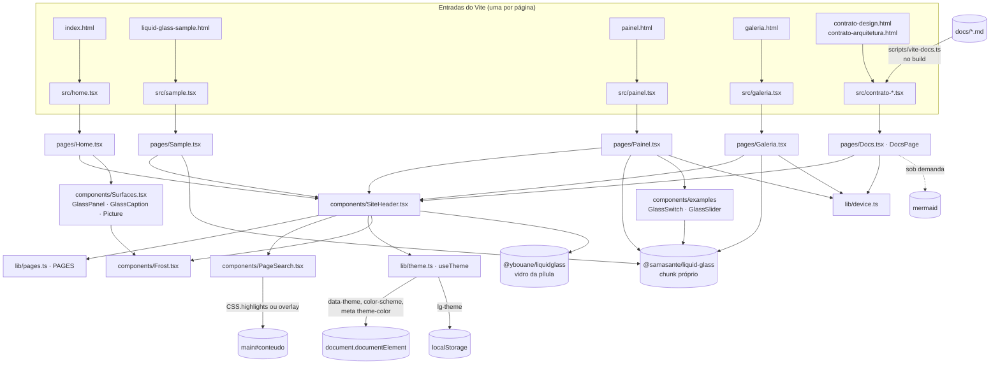

# Arquitetura

> Estado descrito: PR #12 (`novas-paginas-e-contrato`, a partir de `5838a71`, merge do PR #11), atualizado até o PR #15 (`lentes-e-foco`, a partir de `4748463`, merge do PR #14) e, na branch `main-alt`, com o vidro do menu do `liquid-glass2` (§4.1, A8.1). As versões vêm de `package.json` e `pnpm-lock.yaml`.

**Prioridade do projeto (decisão do usuário, PR #15): a translucidez e o vídeo são o foco.**

- **A-P0. Uma mudança que disputa com a translucidez do vidro ou com a refração sobre imagem em movimento DEVE perder.** O vídeo hoje é a apresentação da Galeria (`<Glass draw lenses>`, WebGL 2). Um recurso de vídeo de verdade (`<Glass src>` com um arquivo de vídeo, o modo que a biblioteca oferece para o que o Safari não filtra em SVG) fica para um PR próprio; o PR #15 só registra a prioridade.
  *Por quê:* é o que o projeto quer mostrar. As regras de desempenho (P1–P7) existem para que o vidro possa ser translúcido e vivo sem travar, não para trocá-lo por superfícies opacas.

## 1. Stack

| Camada | Pacote | Especificador (`package.json`) | Versão resolvida (`pnpm-lock.yaml`) |
|---|---|---|---|
| UI | `react` | `^19.2.0` | **19.3.0** |
| UI | `react-dom` | `^19.2.0` | **19.3.0** |
| Vidro | `@samasante/liquid-glass` | `0.1.1` (exato) | **0.1.1** |
| Vidro do menu | `@ybouane/liquidglass` | `1.0.3` (exato) | **1.0.3** (o fork `romastefale/liquid-glass2`; `postinstall` em `pnpm.ignoredBuiltDependencies`, A8.1) |
| Build | `vite` | `^8.0.0` | **8.3.1** |
| Build | `@vitejs/plugin-react` | `^6.0.0` | **6.1.1** |
| Tipos | `typescript` | `^5.7.0` | **5.9.3** |
| Tipos | `@types/react` / `@types/react-dom` | `^19.2.0` | **19.3.0** / **19.3.0** |
| Diagramas | `mermaid` | `11.17.2` (exato) | **11.17.2** (só num chunk carregado sob demanda nas páginas de contrato) |
| Build | `marked` (dev) | `18.0.14` (exato) | **18.0.14** (compila `docs/*.md` no build; não vai para o navegador) |
| Gerenciador | pnpm | `"packageManager": "pnpm@10.28.2"` | lockfile `lockfileVersion: '9.0'` |
| Runtime de build | Node | workflow: `node-version: 22` | o Vite 8.3.1 exige `^20.19.0 \|\| >=22.12.0` |

**Regras**

- **A1. O projeto DEVE usar Vite + `@vitejs/plugin-react`, React 19 e TypeScript em modo `strict`.**
  *Por quê:* é a mesma stack do site de demonstração do fork (`site/package.json`, `site/vite.config.ts`). O PR #4 trocou o HTML estático com script caseiro por essa stack, porque é assim que a biblioteca orienta o uso.
- **A2. O projeto DEVE usar pnpm com a versão fixada em `packageManager` e instalar com `--frozen-lockfile` no CI.**
  *Por quê:* o lockfile fixa o hash de integridade do pacote de vidro (`sha512-i4cQzl…`), e o `pnpm/action-setup@v4` lê a versão desse campo.
- **A3. A dependência de vidro DEVE ter versão exata** (`"0.1.1"`, sem `^`).
  *Por quê:* o visual depende de detalhes internos da biblioteca, como `edgeShadow`, `MATERIAL_OPTICS` e a detecção de Blink. Uma versão menor nova pode mudar esses detalhes.
- **A4. Tailwind e outros frameworks de CSS NÃO DEVEM ser adicionados.**
  *Por quê:* o `site/` do fork usa Tailwind só "for the SITE only", e a biblioteca "works with any CSS". Aqui o CSS é simples, com um arquivo por componente ou página.

`tsconfig.json`: `target`/`lib` ES2020 + DOM, `moduleResolution: "bundler"`, `jsx: "react-jsx"`, `strict: true`, `noEmit: true`, `types: ["vite/client"]`, `include: ["src"]`. A pasta `docs/` fica fora do typecheck; desde o PR #12 ela **entra no build** como conteúdo, pelo plugin `scripts/vite-docs.ts` (§3.1).

## 2. Estrutura de pastas

```text
HTML/
├── .github/workflows/pages.yml   # build + deploy no GitHub Pages (Actions)
├── docs/                         # este contrato; também é o conteúdo das páginas de contrato
├── index.html                    # entrada do Vite: página inicial (portal)
├── liquid-glass-sample.html      # entrada do Vite: amostra
├── painel.html                   # entrada do Vite: painel de widgets
├── galeria.html                  # entrada do Vite: galeria de lugares
├── contrato-design.html          # entrada do Vite: contrato de design (docs/)
├── contrato-arquitetura.html     # entrada do Vite: arquitetura e operação (docs/)
├── package.json / pnpm-lock.yaml
├── tsconfig.json
├── vite.config.ts                # base /HTML/, seis entradas, plugin de docs, portas 4178/4179
├── public/                       # copiado como está para dist/
│   └── img/
│       ├── CREDITS.md            # autor, licença e fonte de cada foto
│       ├── *.jpg                 # 12 originais (1600 px de largura, fallback)
│       └── r/                    # 96 variantes: {nome}-{480,720,1080,1440}.{avif,webp}
├── scripts/
│   ├── make-organic-bg.py        # gera src/assets/fundo-{claro,escuro}.svg (semente fixa; rodar só para mudar o desenho)
│   ├── make-responsive-images.py # gera public/img/r/ a partir dos JPEG
│   └── vite-docs.ts              # plugin: docs/*.md?doc → HTML no build (marked)
└── src/
    ├── home.tsx · sample.tsx · painel.tsx · galeria.tsx
    ├── contrato-design.tsx · contrato-arquitetura.tsx   # cada um monta a sua página em #root
    ├── docs.d.ts                 # tipo do import *.md?doc
    ├── assets/
    │   └── fundo-claro.svg · fundo-escuro.svg  # fundo orgânico (~2,7 kB cada; data URL no CSS e nas raízes de vidro do SiteHeader)
    ├── components/
    │   ├── SiteHeader.tsx/.css   # menu flutuante (☰, seções, tema, lupa), vidro do liquid-glass2; também o fundo e a faixa de cima
    │   ├── PageSearch.tsx/.css   # pesquisa dentro da pílula (Highlight API + fallback)
    │   ├── Frost.tsx             # superfície fosca em CSS puro (blur + saturate)
    │   ├── GlassPill.tsx         # botão de vidro: <Glass> no Blink, <Frost> nos demais
    │   ├── Surfaces.tsx          # GlassPanel, GlassCaption, Picture, WIDTHS, asset() e URLs
    │   └── examples/             # GlassSwitch e GlassSlider, copiados sem mudança do examples/ do fork (MIT)
    ├── lib/
    │   ├── pages.ts              # PAGES (o portal, a lista ☰)
    │   ├── device.ts             # useBox, useOnScreen, useSectionSpy, useDeferredMount, useNear, softwareGL…
    │   ├── mermaid.ts            # drawMermaid(): importa o mermaid sob demanda
    │   ├── optics.ts             # NO_SHINE (specular, sheen e glow 0) e as óticas CONTROL, FROST e PANEL
    │   ├── theme.ts              # useTheme, useThemeName, applyTheme, THEME_KEY, PAGE_EDGE
    │   └── useMedia.ts           # useMediaQuery, useReducedMotion
    ├── pages/
    │   ├── Home.tsx/.css         # portal: cartões das páginas, feed e fotos
    │   ├── Sample.tsx/.css       # lente do título, cartões refract, fotos, notas
    │   ├── Painel.tsx/.css       # segmentado com lente, widgets refract, chaves, avisos, abas
    │   ├── Galeria.tsx/.css      # visor WebGL com lentes, coleção com chips, folha com lupa
    │   ├── Docs.tsx/.css         # DocsPage: renderiza os documentos compilados
    │   └── ContratoDesign.tsx · ContratoArquitetura.tsx  # quais documentos e fotos cada página mostra
    └── styles/
        └── global.css            # fundo orgânico, camadas de borda, hairline, tintas, foco, variáveis
```

## 3. Entradas do Vite e `base`

`vite.config.ts`:

```ts
export default defineConfig({
  base: "/HTML/",                                   // site de projeto do GitHub Pages
  plugins: [react(), docsPlugin()],                 // docsPlugin: scripts/vite-docs.ts
  resolve: { dedupe: ["react", "react-dom"] },
  build: {
    rollupOptions: {
      input: {
        index: entry("./index.html"),
        sample: entry("./liquid-glass-sample.html"),
        painel: entry("./painel.html"),
        galeria: entry("./galeria.html"),
        "contrato-design": entry("./contrato-design.html"),
        "contrato-arquitetura": entry("./contrato-arquitetura.html"),
      },
    },
  },
  server: { host: "127.0.0.1", port: 4178 },
  preview: { host: "127.0.0.1", port: 4179 },
});
```

- **A5. Cada página DEVE ser uma entrada HTML própria em `rollupOptions.input`.** NÃO DEVE haver roteador no cliente.
  *Por quê:* as URLs públicas (`/HTML/`, `/HTML/index.html`, `/HTML/liquid-glass-sample.html`) existiam antes do React e continuaram iguais no PR #4. Com uma entrada por página, cada uma carrega só o JS de que precisa (veja [DESEMPENHO.md](DESEMPENHO.md)). As páginas novas (PR #12) seguem a mesma regra, com nomes curtos em pt-BR: `painel.html`, `galeria.html`, `contrato-design.html` e `contrato-arquitetura.html`.
- **A5.1. Toda página DEVE estar em `PAGES` (`src/lib/pages.ts`)**, com `href`, rótulo do menu, título e resumo. O cartão do portal e os links do menu saem dessa lista.
- **A6. `base` DEVE ser o caminho do repositório** (`/HTML/`), e todo caminho de asset em runtime DEVE passar por `import.meta.env.BASE_URL`, via `asset()` em `Surfaces.tsx`:

  ```ts
  export const asset = (path: string) => `${import.meta.env.BASE_URL}${path}`;
  export const HOME_URL = import.meta.env.BASE_URL;
  export const SAMPLE_URL = `${import.meta.env.BASE_URL}liquid-glass-sample.html`;
  export const CREDITS_URL = `${import.meta.env.BASE_URL}img/CREDITS.md`;
  ```

  *Por quê:* um site de projeto no Pages fica em `/<repo>/`. Um caminho absoluto `/img/...` daria 404.
- **A7. `resolve.dedupe: ["react", "react-dom"]` DEVE ser mantido.**
  *Por quê:* a biblioteca declara React como `peerDependency` (`>=18`). O dedupe garante uma cópia só de React no bundle.

Cada HTML de entrada tem, no `<head>`, um script inline de tema e um `<style>` inline com a cor de fundo. Os dois rodam antes do bundle (veja [TELA-CHEIA-E-BARRAS.md](TELA-CHEIA-E-BARRAS.md)). O `<body>` tem só `<div id="root">`, um `<noscript>` em pt-BR e `<script type="module" src="/src/{página}.tsx">`.

**Chunks gerados** (`pnpm build` no PR #12):

| Arquivo | Bruto | gzip | Conteúdo | Carregado por |
|---|---|---|---|---|
| `assets/Surfaces-*.js` (era `pages-*.js`) | 289,14 kB | 91,13 kB | compartilhado: React, react-dom, SiteHeader, **`@ybouane/liquidglass`** (vidro do menu, com o `html-to-image` embutido), PageSearch, Frost, Surfaces, `pages.ts` e tema. Medido na `main-alt`; antes dela, 237,35 kB / 74,68 kB | todas |
| `assets/index-*.js` | 7,13 kB | 2,73 kB | portal | Início |
| `assets/dist-*.js` (o maior) | 49,35 kB | 16,60 kB | **`@samasante/liquid-glass`** | Amostra, Painel e Galeria |
| `assets/sample-*.js` | 14,40 kB | 5,35 kB | amostra | Amostra |
| `assets/painel-*.js` | 34,70 kB | 11,11 kB | painel, com `GlassSwitch` e `GlassSlider` | Painel |
| `assets/galeria-*.js` | 19,12 kB | 7,18 kB | galeria | Galeria |
| `assets/device-*.js` | 2,69 kB | 1,23 kB | `lib/device.ts` | Painel, Galeria e contratos |
| `assets/Docs-*.js` | 6,73 kB | 3,07 kB | `DocsPage` | contratos |
| `assets/contrato-design-*.js` | ~66 kB | ~20 kB | README, DESIGN-CONTRATO, TELA-CHEIA-E-BARRAS e ACESSIBILIDADE já em HTML | Contrato de design |
| `assets/contrato-arquitetura-*.js` | ~107 kB | ~32 kB | ARQUITETURA, DESEMPENHO, DEPLOY, CHECKLIST e HISTORICO já em HTML | Arquitetura e operação |
| `assets/mermaid.core-*.js` e dependências | ~3,4 MB no total | — | o renderizador de diagramas | só quando alguém toca em "Desenhar diagrama" |
| `assets/pages-*.css` | 11,39 kB | 3,37 kB | `global.css`, `SiteHeader.css` e `PageSearch.css` | todas |

Os dois chunks de contrato são quase só o texto de `docs/` já em HTML, então o tamanho muda a cada edição dos documentos (por isso os valores aproximados). O Vite avisa que alguns chunks do mermaid passam de 500 kB. O aviso é esperado: eles nunca entram no carregamento inicial (não há `modulepreload` para eles).

### 3.1 `docs/` como conteúdo (`scripts/vite-docs.ts`)

- **A15. `docs/*.md` DEVE ser a fonte única do texto das páginas de contrato.** O plugin compila o Markdown no build. Uma página importa `docs/X.md?doc` e recebe `{ id, title, titleHtml, file, html, headings }`. Não há parser de Markdown no navegador.
  *Por quê:* um texto copiado para dentro do site envelheceria separado do contrato. Com o import, editar o `.md` atualiza o site no próximo deploy.
- `DOC_PAGES` diz em qual página cada documento aparece e o prefixo dos seus ids:

  | Página | Documentos (prefixo) |
  |---|---|
  | `contrato-design.html` | README (`visao-geral`), DESIGN-CONTRATO (`design`), TELA-CHEIA-E-BARRAS (`tela-cheia`), ACESSIBILIDADE-E-INTERACAO (`acessibilidade`) |
  | `contrato-arquitetura.html` | ARQUITETURA (`arquitetura`), DESEMPENHO (`desempenho`), DEPLOY (`deploy`), CHECKLIST-VERIFICACAO (`checklist`), HISTORICO (`historico`) |

- **Títulos:** ids no estilo do GitHub com o prefixo do documento (`arquitetura-6-onde-há-glass-e-onde-há-fosco-em-css`). O `#` do documento vira o `h2` da seção (id = prefixo) e é o link da pílula; os demais níveis descem um (a página tem o próprio `h1`).
- **Links:** um link para outro documento vira a página do site que o mostra, com a âncora; links para outros arquivos do repositório vão para o GitHub.
- **Tabelas** ficam em `div.md-table` (rolagem lateral pelo teclado). **Código** fica em `pre.md-code` com `tabindex="0"`.
- **Cartões (PR #13, DESIGN D29):** o plugin percorre os tokens de primeiro nível do `marked` em ordem (os slugs não mudam) e agrupa o HTML em `div.glass.tint-frost.md-card`. Um `##` (`<h3>`) fica fora, acima dos cartões; um `###` abre um cartão; tabela e mermaid ganham um cartão próprio (`.md-card-wide`); cada item de uma lista de regras (`- **D12. …**`, regex `^\*\*[A-Z]{1,2}\d+(\.\d+)*\.\s`) vira um cartão (`.md-rule`); a tabela do HISTORICO (primeira coluna "PR") vira um cartão por PR (`.md-entry`, com `dl`). O fosco dos cartões é CSS puro (`backdrop-filter` em `Docs.css`), com a hairline de `.glass::after`. `Docs.tsx` continua dividindo o corpo nos `<h3>` para a montagem adiada (P6).
- **Mermaid:** o bloco vira uma `figure` com o código legível (é o fallback) e um botão "Desenhar diagrama". O botão importa o mermaid (`src/lib/mermaid.ts`, `securityLevel: "strict"`) e desenha no tema atual; ao trocar o tema, o diagrama é redesenhado.
- Se um documento novo entrar em `docs/`, ele DEVE ganhar uma linha em `DOC_PAGES` (o build falha sem ela) e um lugar em `ContratoDesign.tsx` ou `ContratoArquitetura.tsx`.

## 4. Componentes e fluxo de dados



### 4.1 `SiteHeader` (menu flutuante)

As props são `items: NavItem[]`, `current: PageKey`, `label = "Seções desta página"` e `searchScope = "conteudo"`. Desde o PR #13, a pílula tem, da esquerda para a direita:

1. o **botão ☰** (`button.sh-pages-btn`, `aria-expanded`, `aria-controls`), na ponta esquerda, em toda página;
2. as **seções da própria página**: links `#…`, que rolam dentro dela e seguem o scroll-spy. Só elas ficam na pílula;
3. o botão de tema e a lupa.

O ☰ abre a **lista de páginas** (`.sh-picker`): um elemento de vidro do `liquid-glass2`, filho direto da raiz, sempre no DOM e mostrado com `data-open`, posicionado sob a ponta esquerda da pílula, com um link para cada item de `PAGES` (rótulo `pick`) e `aria-current="page"` na página `current`.

**O vidro:** `@ybouane/liquidglass` (DESIGN-CONTRATO D9.1), com duas raízes: `.sh-root` (a imagem de fundo do modo, o botão ☰, a pílula `<header class="site-header">`, a seleção `.sh-indicator` e os botões de tema e lupa) e `.sh-picker-root` (a imagem de fundo e a lista `.sh-picker`). Num `useEffect`, depois de `document.fonts.ready`:

```ts
LiquidGlass.init({ root: barra, glassElements: [☰, pílula, seleção, tema, lupa] });
LiquidGlass.init({ root: lista, glassElements: [listaDeVidro] });
```

- `data-config`: Pílula e lista ☰: "Frosted Panel" (`{ blurAmount: 0.25, cornerRadius: 30 }`) no claro, "Dark Glass" (`{ brightness: -0.3, blurAmount: 0.25, cornerRadius: 50 }`) no escuro. Botões ☰, tema e lupa: `{ button: true, cornerRadius: 28, blurAmount: 0.3, brightness: -0.1 }` (`#glass-btn-1`). Seleção: `{ cornerRadius: 16, zRadius: 16, blurAmount: 0, edgeHighlight: 0.2, shadowOpacity: 0.25 }` (`#glass-tab-indicator`). Como no `site/index.html` do fork.
- Troca de tema: a imagem de fundo troca de `src` e as duas instâncias recebem `markChanged()`.

| Página | Seções na pílula |
|---|---|
| Início | Início (`#topo`), Páginas, Menu, Busca, Fundo, Cartões, Céu noturno, Créditos |
| Amostra | Lente (`#topo`), Componentes, Lugares, Suporte, Créditos |
| Painel | Tela, Controles, Avisos, Widgets, Créditos |
| Galeria | Visor, Coleção, Como funciona, Créditos |
| Contrato de design | Visão geral, Design, Tela cheia, Acessibilidade, Créditos |
| Arquitetura e operação | Arquitetura, Desempenho, Deploy, Checklist, Histórico, Créditos |

Estado interno:

| Estado | Para quê |
|---|---|
| `searchOpen` | alterna `data-mode="menu" \| "search"` na pílula |
| `pickerOpen` | mostra a lista de páginas (`data-open`, `inert` quando fechada). Esc, toque fora, foco saindo, escolha ou ☰ de novo fecham; abrir a pesquisa também |
| `active` | índice da seção atual (scroll-spy) → `aria-current="location"`; só links de seção entram na conta |
| `active` → `.sh-indicator` | a seleção de vidro recebe a largura, a altura e o `transform` do link atual |
| `fade {start, end}` | degradê só no lado em que há mais links |
| `pinned` (ref) | depois de um toque em um link, pausa o scroll-spy por 700 ms. O prazo se renova por 220 ms enquanto a página rola, para a seleção não voltar no meio da rolagem |

Os detalhes de interação estão em [ACESSIBILIDADE-E-INTERACAO.md](ACESSIBILIDADE-E-INTERACAO.md).

### 4.2 `PageSearch` (pesquisa)

`PageSearch` fica sempre montado dentro da pílula e recebe `open`. Com `open = false`, ele fica `inert` e invisível. Ele procura nos nós de texto de `#conteudo` (o `<main>` de cada página). Blocos marcados com `data-search-skip` (barras de filtro e índices de seções) ficam de fora.

- A busca começa a partir de 2 caracteres, com debounce de 160 ms.
- As ocorrências são destacadas com a CSS Custom Highlight API. Onde ela não existe, caixas são desenhadas por cima do texto (portal em `body`).
- O rodapé da amostra (`footer#creditos`) está **fora** do `<main>` e, por isso, não entra na pesquisa.

### 4.3 Tema

`lib/theme.ts` exporta `useTheme()`, que devolve `{ theme, toggle }`, e também `applyTheme(t)`, `THEME_KEY = "lg-theme"` e `PAGE_EDGE = { light: "#8b82e6", dark: "#1b1646" }`.

O estado inicial vem de `<html data-theme>`, já definido pelo script inline. Enquanto não há escolha salva, o tema acompanha `prefers-color-scheme`. O `toggle` salva a escolha em `localStorage` e aplica `data-theme`, `style.colorScheme` e `meta[name=theme-color]`.

### 4.4 Páginas

- **`Home`:** um link "Pular para o conteúdo", o `SiteHeader` e `<main class="feed" id="conteudo">`. Dentro do `main` ficam um `GlassPanel` de introdução, a seção `#paginas` ("Páginas do portal", um cartão-link `GlassPanel` para cada página de `PAGES`), seis `Card` (que são `GlassPanel`), três `Photo` (`Picture` + `GlassCaption`) e o rodapé em `GlassPanel`.
- **`Sample`:**
  - um `Hero` com a lente no lugar e duas `GlassPill`;
  - a seção de componentes, com três `BandCard` sobre `.band` e três `GlassPill`;
  - a seção de lugares, com três `Place` (`Picture` + `GlassCaption`);
  - a seção de suporte, com quatro `Note` (`GlassPanel`);
  - o rodapé em `GlassPanel`.

- **`Painel`** (§4.7), **`Galeria`** (§4.8) e **`DocsPage`** (§4.9) usam o mesmo esqueleto: link de pular, `SiteHeader`, `main#conteudo` e rodapé de créditos.

### 4.5 A lente do título (`Hero`)

- **Modo:** lente **no lugar** (`size` + `center` + filhos), o mesmo padrão do `LiveHero` em `site/src/views/Docs.tsx` do fork. A ótica é `HERO_LENS` (baseada na do docs, com `NO_SHINE`: `specular`, `sheen` e `glow` 0).
- **Palco:** `.hero-stage`, do tamanho do bloco do título, **não** do hero inteiro. Ele vai de `88px + safe-top` até `132px + safe-bottom`, com largura máxima de 1100 px.
- **Tamanho da lente:** `round(clamp(130, 0.42 × largura do palco, 200))` px, com `radius = size / 2`.
- **Posição:** o centro é um par de `glassValue` (`x`, `y`) em frações do palco.
  - Em repouso: `{0.3, 0.42}`.
  - Órbita: centro (0.5, 0.5), raios 0.26 × 0.14, velocidade 0.5 rad/s.
  - O centro fica preso para o disco caber inteiro no palco (como o `clampBox` do `GlassDemo`).
- **Correção do oval:** `scaleX = s·min(w,h)/w` e `scaleY = s·min(w,h)/h`.
- **Hairline:** um `.hero-ring`, que acompanha `x`/`y` pelos eventos `change`, desenha a linha uniforme sobre a lente.
- **Loop de animação:** `requestAnimationFrame`, pausado quando o hero sai da tela (IntersectionObserver) ou a aba fica oculta (`visibilitychange`).
- **Ponteiro:**
  - o mouse move a lente;
  - um toque posiciona a lente e a segura por 1,6 s;
  - ao rolar com o mouse parado, a lente volta a mirar o cursor.

### 4.6 Cartões `refract` (`BandCard`)

Mesmo padrão de `examples/GlassNotification.tsx` do fork.

- Um `<Glass refract={cópia} behind={--band-edge}>` com `width`, `height` e `radius` medidos (ResizeObserver no cartão e na faixa).
- A cópia é um `div` com `background: var(--band-bg)`, deslocado por `-left` e `-top` para ficar alinhado com a faixa real.
- A ótica é `PANEL_LENS` (`mapSize: 256`, `strength: 0.17`, `NO_SHINE`…) com `brightnessInFilter`.
- O conteúdo nítido fica por cima, em `.gcard-body`.

### 4.7 Painel (`pages/Painel.tsx`)

- **Palco `#tela`:** um papel de parede (`Picture`) que muda com a hora do dia (manhã: Lençóis; tarde: Rio; noite: aurora), com brilho ajustável.
- **Controle segmentado** (`role="radiogroup"`): pílula `<Frost>`; a seleção é uma lente **no lugar** (`SEG_LENS`, `NO_SHINE`, oval corrigido como no hero da amostra) que desliza com `animateGlassValue` e a mola `EASE`. Um `.seg-ring` desenha a hairline sobre a lente.
- **Widgets de clima e lembrete:** `<Glass refract={cópia da foto do palco}>` com `WIDGET_LENS` (receita do `examples/GlassNotification.tsx`, `NO_SHINE`), geometria medida por ResizeObserver; o texto nítido fica em `.rcard-body`.
- **Central de controles `#controles`:** duas `GlassSwitch` e um `GlassSlider` do `examples/` do fork (copiados sem mudança, com o cabeçalho MIT), com `lens={NO_SHINE}` e `filterResolution` do aparelho.
- **Avisos e widgets:** tudo fosco em CSS (`GlassPanel`): notificações com "Limpar avisos", calendário, baterias, tarefas e previsão de 5 dias.
- **Barra de abas:** fixa embaixo (`<Frost>`, `bottom: 12px + safe-bottom`), com indicador deslizante e `useSectionSpy`. Ela repete as seções; a pílula do topo continua igual à das outras páginas.
- **Montagem adiada (P6):** a lente do segmentado e os widgets montam um por vez depois da primeira pintura (`useDeferredMount`); as chaves e o controle deslizante montam quando a central chega perto da tela (`useNear`), sobre chaves planas do mesmo tamanho, que já funcionam (`role="switch"`).

### 4.8 Galeria (`pages/Galeria.tsx`)

- **Visor `#visor`:** uma apresentação de 9 fotos. O pôster é um `Picture`. Quando o visor está na tela, a aba visível, a apresentação tocando, a primeira foto decodificada **e o WebGL roda na GPU**, monta um `<Glass draw lenses maxDpr={1}>` (modo `draw` + `lenses` do README do fork): o `draw` pinta a foto com zoom lento e transição, e o WebGL desenha quatro lentes (voltar, tocar/pausar, avançar e a barra de progresso), com óticas do `GlassVideoControls` do fork e `NO_SHINE`. O canvas usa a mesma variante (largura e formato) que o pôster escolheu.
- **Sem lentes:** pausado, fora da tela, com movimento reduzido, sem WebGL 2 ou com WebGL em software (`softwareGL()`), os controles são discos e barra `<Frost>`; sem GPU, a apresentação começa pausada e, ao tocar, troca as fotos com um temporizador simples.
- **WebGL 2 (PR #15):** o renderizador da biblioteca só funciona com WebGL 2 (`src/glassWebGL.ts` lança "webgl2 unavailable", e o `<Glass draw>` mostra então um texto cinza em inglês, "WebGL unavailable"). Por isso `hasWebGL()` testa só `getContext("webgl2")`, e `softwareGL()` (`lib/device.ts`) lê o renderizador de um contexto WebGL 2. Um aparelho só com WebGL 1 recebe o fosco do site.
- **Coleção `#colecao`:** barra de chips fixa (`<Frost>`, `aria-pressed`) com Todas/Brasil/Mundo/À noite e uma grade de fotos com `GlassCaption`.
- **Folha:** um `<dialog>` modal com a foto e uma **lupa** `<Glass refract>` sobre uma cópia ampliada 1,8× (`LOUPE_LENS`), movida por ponteiro ou setas. A folha tem tinta mais densa, porque o WebKit não desfoca atrás de um `<dialog>` na top layer.
- **A lupa sem render (PR #15):** a posição fica num ref (fração da foto). O ponteiro e as setas só gravam a posição e pedem um quadro (`requestAnimationFrame`, um por quadro, por mais eventos que cheguem); o quadro escreve o `transform` do invólucro `.loupe` e o `left`/`top` da cópia, direto no DOM. Nada disso passa pelo estado do React (0 commits num arrasto de 120 movimentos; antes, 121). O `transform` fica no invólucro, nunca no elemento filtrado. A cópia fica dentro de um recorte do tamanho da lupa mais o alcance da lente (`COPY_REACH`, 40px), então cada quadro rasteriza uma fonte pequena, não a foto inteira ampliada.
  - **Por que não o `<Glass pixelUnits center>` do fork** (a lente do tamanho do palco, movida só pelo `center`): no WebKit, a região `userSpaceOnUse` desse modo, fixada em 0,0 pela biblioteca, é resolvida a partir do ancestral com `transform` mais próximo (ou da página), não do elemento. Com o palco a mais de ~150px do topo da página, como na folha, a lente fica vazia ou deslocada. Medido no PR #15 com um banco de teste isolado (a mesma lente funciona a 20–100px do topo e some a partir de 200px; no Chromium funciona em qualquer posição).

### 4.9 Páginas de contrato (`pages/Docs.tsx`)

- `ContratoDesign.tsx` e `ContratoArquitetura.tsx` só escolhem os documentos, os rótulos da pílula e as fotos; `DocsPage` renderiza.
- **Topo:** uma foto de skyline (`Picture` com `fetchpriority="high"`) com um `GlassPanel` escuro por cima (título, resumo e crédito).
- **Cada documento** é um `GlassPanel` com o link "Fonte", o título (`h2`, id = prefixo, alvo da pílula), um índice de chips das seções e o corpo.
- **O corpo** é dividido nas seções do documento; cada parte monta num intervalo ocioso, na ordem da página (`useDeferredMount`), com a altura estimada reservada até lá. Um link direto para uma seção (`#arquitetura-…`) rola até ela quando a parte monta.
- **Entre documentos**, fotos de skylines com `GlassCaption` (autor e licença).
- Nenhum `<Glass>`: a biblioteca não é baixada.

## 5. Como a biblioteca é consumida

- **A8. A biblioteca DEVE vir do npm** (`"@samasante/liquid-glass": "0.1.1"`).
  - **NÃO DEVE** vir como dependência GitHub (`github:romastefale/liquid-glass`).
  - **NÃO DEVE** vir como bundle vendorizado em `assets/`.

  *Por quê:*
  - O fork **não versiona `dist/`** (está no `.gitignore`) e não tem script `prepare`. Instalado via GitHub, o pacote viria vazio.
  - O `dist/` publicado no npm é **byte a byte idêntico** ao build do fork em `4e7b769`. Foi conferido no PR #4 e de novo ao escrever este documento: `cmp` de `dist/index.js` e `dist/index.d.ts` depois de `pnpm build` no fork. Ou seja, é o código do fork, com integridade fixada pelo lockfile.
  - O bundle vendorizado (PRs #1–#3) foi removido no PR #4.
- **A8.1. O vidro do menu DEVE vir do npm** (`"@ybouane/liquidglass": "1.0.3"`, exato), não do GitHub.
  O fork não versiona `dist/`. O pacote npm é idêntico ao fork em `59af227`: os 6 arquivos de `src/` são iguais, e `dist/index.js` e `dist/index.d.ts` são iguais (`cmp`) ao `npm ci && npm run build` do fork. O `postinstall` do pacote (`patch-package`) não tem o que aplicar no projeto que instala (o `html-to-image` já vem no `dist`) e fica em `pnpm.ignoredBuiltDependencies`.
- **A9. Só a API pública DEVE ser importada:** `Glass`, `glassValue`, `animateGlassValue`, `cubicBezier` e os tipos (`GlassOptics`, `GlassSurfaceLens`, …); os exemplos copiados usam também `GlassDiv` e os utilitários públicos de movimento.
  - Só importam valores da biblioteca: `pages/Sample.tsx`, `pages/Painel.tsx`, `pages/Galeria.tsx`, `components/GlassPill.tsx` e `components/examples/*`. Os demais arquivos **só podem importar tipos** (`import type`). É o caso de `lib/optics.ts`, `components/Frost.tsx` e `components/Surfaces.tsx`.

  *Por quê:* `import type` é apagado na compilação. Assim a biblioteca fica num chunk próprio (`dist-*.js`), baixado só pela amostra, pelo painel e pela galeria; o Início e os contratos não o carregam (PRs #9 e #12).

### Modos da biblioteca usados

| Modo (README do fork) | Como se ativa | Onde é usado aqui |
|---|---|---|
| **Material** (a caixa translúcida vira vidro) | `<Glass>` sem geometria | `GlassPill` **só no Blink** (5 botões na amostra) |
| **No lugar** (a lente dobra os próprios filhos) | `size` + `center` + filhos | a lente do título da amostra; a seleção do segmentado do painel |
| **Cópia** (`refract` + `behind`) | `refract={nó}` e `behind={cor}` | os 3 cartões da faixa da amostra; os 2 widgets do painel; a lupa da folha da galeria |
| **Canvas + várias lentes** (WebGL) | `draw={fn}` + `lenses=[…]` | o visor da galeria (4 lentes num renderizador) |
| **Receitas do `examples/`** | `GlassSwitch`, `GlassSlider` | a central de controles do painel |

## 6. Onde há `<Glass>` e onde há fosco em CSS

| Superfície | Componente | Implementação | Ótica / valores | Página |
|---|---|---|---|---|
| Pílula do menu | `SiteHeader` | `LiquidGlass` (`@ybouane/liquidglass`, WebGL), sem `<Frost>` | "Frosted Panel" (claro) / "Dark Glass" (escuro) | todas |
| Botões ☰, tema e lupa | `.sh-btn` | `LiquidGlass` (`button: true`) | `#glass-btn-1` do fork | todas |
| Introdução, cartões e rodapé | `GlassPanel` | `<Frost>` + `.tint-frost` | `PANEL`: `blur(22px) saturate(1.4)` | Início |
| Notas e rodapé | `GlassPanel` | `<Frost>` + `.tint-frost` | `PANEL` | Amostra |
| Legendas das fotos | `GlassCaption` | `<Frost>` + `.tint-ink` | `FROST` | todas com fotos |
| Botões de vidro (5) | `GlassPill` | **Blink:** `<Glass optics={CONTROL}>` (curvatura ao vivo). **Outros:** `<Frost optics={CONTROL}>` | `CONTROL` = material padrão + `NO_SHINE` (`frost` 6, `saturate` 1.15) | Amostra |
| Lente do título | `Hero` | `<Glass>` no lugar | `HERO_LENS` | Amostra |
| Cartões da faixa (3) | `BandCard` | `<Glass refract behind>` | `PANEL_LENS` | Amostra |
| Cartões do portal, documentos, avisos, widgets, notas e rodapés | `GlassPanel` | `<Frost>` + `.tint-frost` | `PANEL` | todas |
| Pílula do segmentado, barra de abas, barra de chips | `<Frost>` | `.tint-control` / `.tint-bar` | `FROST` | Painel, Galeria |
| Seleção do segmentado | `Segmented` | `<Glass>` no lugar | `SEG_LENS` | Painel |
| Widgets de clima e lembrete (2) | `RefractCard` | `<Glass refract behind>` | `WIDGET_LENS` | Painel |
| Chaves (2) e controle deslizante (1) | `GlassSwitch`, `GlassSlider` | receitas do fork | `lens: NO_SHINE` | Painel |
| Controles do visor (4 lentes) | `Viewer` | `<Glass draw lenses>` (WebGL, 1 renderizador) | `PLAYER_OPTICS`, `SCRUB_OPTICS` | Galeria |
| Controles do visor sem lentes | `.vw-disc`, `.vw-bar` | `<Frost>` + `.tint-ink` | `FROST` | Galeria |
| Lupa da folha | `SheetBody` | `<Glass refract>` | `LOUPE_LENS` | Galeria |
| Topo das páginas de contrato | `GlassPanel` | `<Frost>` + `.tint-ink` | `PANEL` | Contratos |

Contagem de `<Glass>` por página:

| Página | `<Glass>` | Laço contínuo |
|---|---|---|
| Início | 0 | nenhum |
| Amostra | 4 fixos (a lente e 3 cartões), mais 5 no Chromium (os botões) | a órbita da lente, só na tela |
| Painel | 6 (seleção, 2 widgets, 2 chaves, 1 controle deslizante) | nenhum: só anima ao interagir |
| Galeria | 1 renderizador WebGL com 4 lentes (só tocando, na tela e com GPU) + 1 lupa quando a folha está aberta | o `draw` do visor, só nessas condições |
| Contratos | 0 | nenhum |

Medido no DOM do build do PR #15, na amostra, com iPhone 15 emulado (na `main-alt` a pílula do menu deixou de ser `[data-frost]`: uma superfície a menos em cada motor):

| Motor | Superfícies `[data-frost]` | `backdrop-filter: url()` | `filter: url()` | `<filter>` SVG | mapas `data:` em `feImage` |
|---|---|---|---|---|---|
| Chromium | 9 | 5 (botões) | 1 (lente) | 6 | 7 |
| WebKit | 14 | 0 | 1 (lente) | 1 | 2 |

Os 3 cartões `refract` não criam `<filter>` SVG próprio no DOM.

- **A10. Uma superfície só de fosco (sem refração: `strength: 0`, `dispersion: 0`, `specular: 0`) DEVE usar `<Frost>`, NÃO um `<Glass>` material.**
  *Por quê (PR #9):* o `<Glass>` material gera um mapa de deslocamento no main thread para cada instância (canvas pixel a pixel e `toDataURL`, um PNG de ~110 KB em data URL). Isso acontece até quando a força é 0, e até no WebKit/Gecko, onde o mapa nem é usado. No Chromium, ele ainda aplica um `backdrop-filter: url(#svg)` que não muda nada visualmente, mas é re-rasterizado a cada quadro de rolagem. O `<Frost>` desenha exatamente o mesmo visual: `blur()` e `saturate()` com os valores de `MATERIAL_OPTICS` do fork, a tinta no `background` do elemento e a hairline no `.glass::after`. A comparação pixel a pixel com o site anterior deu diferença máxima de 0–6/255.
- **A11. O `<Glass>` material só DEVE ser montado onde a curvatura ao vivo aparece, ou seja, no Blink.** A detecção DEVE ser a mesma da biblioteca (`useSupportsBackdropUrl` em `src/GlassMaterial.tsx`):

  ```ts
  const isBlink = hasUAData ||
    (/\b(?:Chrome|Chromium|Edg)\//.test(ua) && !/\b(?:CriOS|EdgiOS|FxiOS|OPiOS)\b/.test(ua) && !/iPhone|iPad|iPod/.test(ua));
  ```

  *Por quê:* `backdrop-filter: url()` só existe no Blink (`BROWSERS.md`). No Safari e no Firefox, o material pinta só fosco e tinta, mas continua gerando o mapa.
- **A12. Barras e painéis largos NÃO DEVEM usar lente de deslocamento.**
  *Por quê:* `BROWSERS.md › Known limitations`: "Very wide panels … shouldn't use a single stretched displacement lens, because it blooms an oval. Use a frost-only treatment."
- **A13. Lentes DEVEM ser do tamanho do conteúdo, e deve haver poucas.**
  *Por quê:* `BROWSERS.md`: "SVG filters are GPU-bound … keep lenses content-sized and prefer one or a few". Além disso, o WebKit tem um teto de tamanho para a fonte do filtro.

## 7. Óticas (`src/lib/optics.ts`)

```ts
export const NO_SHINE = { specular: 0, sheen: 0, glow: 0 };
export const CONTROL = { ...NO_SHINE };                                                   // material padrão, sem aro nem brilho
export const FROST   = { ...NO_SHINE, strength: 0, dispersion: 0, frost: 6,  saturate: 1.15 };
export const PANEL   = { ...NO_SHINE, strength: 0, dispersion: 0, frost: 22, saturate: 1.4 };
```

- **A14. Toda ótica DEVE espalhar `NO_SHINE` (`specular: 0`, `sheen: 0`, `glow: 0`).** A hairline DEVE vir do CSS (`.glass::after`).
  *Por quê:* o `edgeShadow` do material sempre junta um realce de 1 px no topo (`.55·g`) com um aro em volta (`.12·g`), e `specular` é o único controle. Nas lentes, `specular` também é o ganho do brilho direcional e do glow interno, mas a biblioteca só tira as duas primitivas deles do filtro quando `sheen` e `glow` também são 0 (`hasSpecular = glow > 0 || sheen > 0`). No WebGL, o brilho usa `u_sheen = specular`, que já é 0. Veja [DESIGN-CONTRATO.md](DESIGN-CONTRATO.md) §3 e D7.

`frostFilter(optics)` em `Frost.tsx` converte a ótica em CSS: `blur(${frost ?? 6}px) saturate(${saturate ?? 1.15})`. Um termo é omitido quando o blur é 0 ou a saturação é 1.
