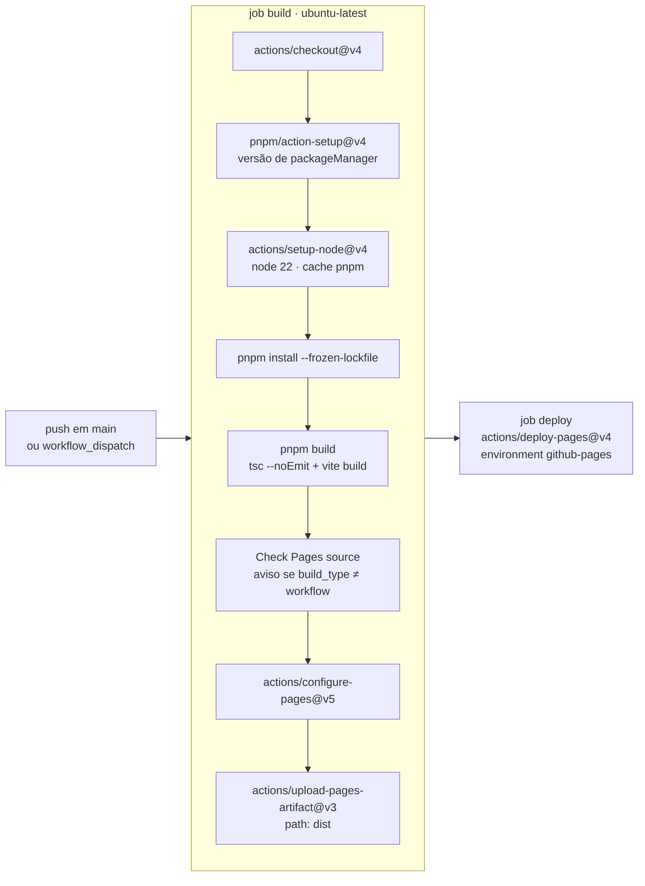

# Deploy (GitHub Pages via GitHub Actions)

## 1. Configuração do Pages

- **R1. Settings → Pages → Build and deployment → Source DEVE ser "GitHub Actions".** Hoje é `build_type: "workflow"`, conferido com `gh api repos/romastefale/HTML/pages`.
  *Por quê:* no modo "Deploy from a branch" (legacy), o Pages publica a raiz do repositório **sem build**. As páginas apontariam para `/src/*.tsx`, e o site ficaria em branco.
- **R2. ⚠️ Num projeto novo, ou numa migração de HTML estático para Vite, a fonte DEVE ser trocada para "GitHub Actions" ANTES do merge do PR que introduz o Vite.**
  *Por quê:* foi o aviso do PR #4. Trocar antes não quebra nada, porque o workflow já publica o que houver. Trocar depois deixa o site em branco entre o merge e a troca. O workflow também avisa no log (`::warning::`) se a fonte não for `workflow`.

## 2. Workflow `.github/workflows/pages.yml`



| Item | Valor |
|---|---|
| Gatilhos | `push` em `main`; `workflow_dispatch` |
| Permissões | `contents: read`, `pages: write`, `id-token: write` |
| Concorrência | `group: pages`, `cancel-in-progress: true` |
| Node | 22 (o Vite 8.3.1 exige `^20.19.0 \|\| >=22.12.0`) |
| pnpm | a versão de `"packageManager": "pnpm@10.28.2"` |
| Artefato | `dist/` |

- **R3. O CI DEVE usar `pnpm install --frozen-lockfile`.**
  *Por quê:* um lockfile desatualizado falha o build, em vez de instalar outra versão da biblioteca em silêncio.
- **R4. `pnpm build` DEVE incluir o typecheck** (`"build": "tsc --noEmit -p tsconfig.json && vite build"`), para um erro de tipo não chegar a ser publicado.
- **R5. Só o que está em `dist/` é publicado.** O conteúdo de `public/` é copiado como está. `docs/`, `scripts/` e `src/` não vão para o site.

## 3. Comportamento do Pages (medido, não configurável)

| Aspecto | Valor observado |
|---|---|
| Compressão | `content-encoding: gzip` (mesmo com `Accept-Encoding: gzip, br`), sem brotli |
| Cache | `cache-control: max-age=600` para o HTML e para os assets com hash |
| Validação | `etag` e `last-modified` presentes (permitem revalidação condicional depois que o `max-age` expira) |
| Tempo de resposta do HTML | ~0,12–0,18 s (medido no PR #9) |

Consequências:

- Depois de um deploy, um visitante pode ver a versão anterior por até **10 minutos**.
- Cada deploy substitui o site inteiro. Um HTML antigo em cache aponta para os assets com hash **antigos**:
  - se eles também estiverem em cache, a versão anterior continua consistente;
  - se não estiverem, esses pedidos podem dar 404 até o HTML expirar.

  Por isso, ao verificar um deploy, espere o `max-age` ou use uma aba anônima.

## 4. Como verificar um deploy

```bash
# 1. O workflow terminou com sucesso no commit certo
gh run list --workflow pages.yml --limit 3 --json conclusion,headSha,createdAt

# 2. A fonte do Pages é "workflow"
gh api repos/romastefale/HTML/pages --jq .build_type

# 3. O HTML ao vivo aponta para os assets do build novo (compare com dist/ local)
curl -s https://romastefale.github.io/HTML/ | grep -o 'assets/[^"]*'
for p in liquid-glass-sample painel galeria contrato-design contrato-arquitetura; do
  curl -s "https://romastefale.github.io/HTML/$p.html" | grep -o 'assets/[^"]*'; done

# 4. Cabeçalhos
curl -sI https://romastefale.github.io/HTML/ | grep -iE '^(cache-control|content-encoding|last-modified|etag)'

# 5. Sem 404: cada asset e cada imagem respondem 200
for a in $(curl -s https://romastefale.github.io/HTML/ | grep -o 'assets/[^"]*'); do
  curl -s -o /dev/null -w "%{http_code} $a\n" "https://romastefale.github.io/HTML/$a"; done
```

Depois, abra as seis páginas num navegador com cache limpo e o console aberto: deve haver 0 erros e 0 respostas 404 na aba de rede.

## 5. Regenerar as imagens

Quando uma foto entrar ou for trocada:

1. Coloque o JPEG original em `public/img/{nome}.jpg`, com no máximo 1600 px de largura (é o fallback).
2. Registre autor, licença e fonte em `public/img/CREDITS.md`.
3. Gere as variantes:

   ```bash
   python3 scripts/make-responsive-images.py
   ```

   - Saída: `public/img/r/{nome}-{480,720,1080,1440}.{avif,webp}`.
   - AVIF com `quality=55, speed=4`; WebP com `quality=78, method=6`; redimensionamento LANCZOS.
   - Requer Pillow com suporte a AVIF. O script tenta `pillow_avif` se ele estiver instalado. Testado com Pillow 12.3.0, onde gerou os 48 arquivos originais byte a byte iguais aos versionados. No PR #12, o mesmo script gerou as 48 variantes das seis fotos de skylines (hoje são 96 arquivos em `r/`).
4. Use `<Picture name="{nome}" … sizes="…">` com o `sizes` da largura desenhada (veja [DESEMPENHO.md §P1](DESEMPENHO.md#p1-imagens-responsivas-obrigatório)).
5. Versione as variantes. O CI **não** gera imagens.
