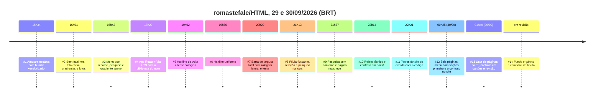

# Histórico de decisões (PRs #1 a #14)

Os PRs #1 a #11 foram mergeados em **29/09/2026**, o #12 em **30/09/2026** às 00:25 e o #13 no mesmo dia, às 01:49, depois dos testes. O #14 foi aberto em seguida e está em revisão (sem merge). Os horários estão em **BRT** (UTC−3), convertidos do `mergedAt` do GitHub.

| PR | Merge (BRT) | Branch | Decisão | Motivo | O que ficou valendo |
|---|---|---|---|---|---|
| [#1](https://github.com/romastefale/HTML/pull/1) | 15:34 | `liquid-glass-sample` | Página de amostra estática, com o fork compilado e empacotado com React em `assets/liquid-glass/liquid-glass.bundle.js`. Wallpapers do fork | Mostrar o efeito sem etapa de build | Nada da técnica (removida no #4). Ficaram a ideia da amostra, o link a partir do Início e a lente que segue o cursor |
| [#2](https://github.com/romastefale/HTML/pull/2) | 16:01 | `liquid-glass-sample` | Tirou todas as hairlines. Mesmo estilo no `index.html`. Tela de ponta a ponta (`viewport-fit=cover`, safe areas, `svh`/`dvh`, `theme-color`, `black-translucent`). Gradientes no lugar dos wallpapers. Fotos livres do Wikimedia | Pedido de design. O Safari 26 ignora `theme-color` e tinge as barras pela cor de fundo | Tela cheia e safe areas; fotos com créditos; pinça permitida; sem `interactive-widget` (erro no WebKit). A remoção total das linhas foi revertida no #5 |
| [#3](https://github.com/romastefale/HTML/pull/3) | 16:42 | `liquid-glass-nav-busca` | Menu compartilhado que recolhe em "…" com popover. Pesquisa na barra de baixo (Highlight API). Gradiente suave sem discos. `--page-edge` nas duas pontas do gradiente e em `html`/`body`. `theme-color` por esquema. Nada fixo encosta nas bordas | Os discos viravam manchas sob o vidro. As barras do navegador devem parecer a página | O fundo em gradiente suave (trocado no #14 pelos campos orgânicos desfocados, com as mesmas bordas), `--page-edge` (`#8b82e6` / `#1b1646`) e a regra das bordas. O "…" e a barra de baixo foram removidos depois |
| [#4](https://github.com/romastefale/HTML/pull/4) | 18:29 | `liquid-glass-react` | Tudo refeito como app React 19 + Vite + TS, com `@samasante/liquid-glass@0.1.1` do npm (byte a byte igual ao fork em `4e7b769`). Três modos do `<Glass>`. Deploy por Actions. Pesquisa sem `<mark>` | Seguir a orientação da biblioteca (mesma stack do `site/` do fork). Uma dependência GitHub viria vazia. O React é dono dos nós de texto | **A arquitetura atual.** O aviso de trocar a fonte do Pages antes do merge |
| [#5](https://github.com/romastefale/HTML/pull/5) | 19:02 | `liquid-glass-hairline` | Voltou o aro padrão da biblioteca (`specular` 1). Corrigiu a lente: sem `text-shadow`, palco do tamanho do título, centro preso, reaponta ao rolar, toque posiciona, `filterResolution={2}` em telas 1× | Sem nenhuma linha, o vidro perdia a forma. Bugs visuais da lente | O palco da lente, os comportamentos de toque e rolagem, e nada de `text-shadow` no texto refratado |
| [#6](https://github.com/romastefale/HTML/pull/6) | 19:56 | `liquid-glass-hairline-uniforme` | `specular: 0` em tudo, e uma hairline uniforme em `.glass::after` (`--rim` `.18`/`.14`, `--rim-w` 1px / 0,5px), por fora da borda. O `.hero-ring` na lente. A pilha de bordas dos cartões `refract` reduzida à mesma linha | O aro da biblioteca sempre traz um realce de topo mais claro, e `specular` é o único controle | **A hairline atual** |
| [#7](https://github.com/romastefale/HTML/pull/7) | 20:29 | `menu-scroll-horizontal` | Barra fosca de largura total, como o cabeçalho do site do fork: marca, links com rolagem lateral e degradê, scroll-spy e botão claro/escuro (`lg-theme`, padrão do sistema, script antes da pintura). Removeu o "…" | Menu igual em toda a página. Paleta e tamanhos do `site/` | A rolagem lateral, o tema e a paleta. A barra encostada no topo e a marca foram revertidas no #8 |
| [#8](https://github.com/romastefale/HTML/pull/8) | 21:13 | `menu-flutuante-pesquisa` | Voltou a pílula flutuante (12px), sem marca. Pílula de seleção deslizante, com a seleção fixada ao tocar. A lupa transforma a pílula na pesquisa, e tocar de novo fecha. Removeu a barra de pesquisa de baixo. `theme-color` volta a ser `--page-edge` | Nada sólido deve encostar na borda (Safari 26). Uma coisa por lugar | **O menu e a pesquisa atuais** |
| [#9](https://github.com/romastefale/HTML/pull/9) | 21:57 | `pesquisa-sem-contorno-desempenho` | Sem anel azul no modo pesquisa. `<Frost>` (CSS) nas superfícies só de fosco. `<Glass>` material só no Blink. `<picture>` AVIF/WebP. Biblioteca só no chunk da amostra. `filterResolution` e fps condicionados ao aparelho. Favicon `data:` | Pedido de design. A página pesava por causa do código (mapas, filtros identidade, JPEGs grandes), não do deploy | **As regras de desempenho atuais** (veja [DESEMPENHO.md](DESEMPENHO.md)) |
| [#10](https://github.com/romastefale/HTML/pull/10) | 22:14 | `docs-contrato-tecnico` | Relato técnico e contrato normativo em `docs/` (arquitetura, design, tela cheia, desempenho, deploy, acessibilidade, checklist e histórico). README da raiz atualizado | Projetos futuros devem repetir a implementação que deu certo, com cada regra justificada | **Este contrato.** A regra de manter os textos do site em dia com o código (os textos desatualizados foram corrigidos logo depois) |
| [#11](https://github.com/romastefale/HTML/pull/11) | 22:21 | `textos-atualizados` | Textos do site, `noscript` do Início e crédito do rodapé conferidos com o código: vidro fosco em CSS × `<Glass>`, legendas e créditos das variantes AVIF/WebP | Regra D28: o texto deve descrever o que a página faz | Os textos corretos, e a seção "Textos do site" do README de `docs/` |
| [#12](https://github.com/romastefale/HTML/pull/12) | 00:25 (30/09) | `novas-paginas-e-contrato` | Menu com as seções primeiro e, depois de um ponto, "‹ Início" e as outras páginas (`pageNav`). Duas páginas de exemplo: **Painel** (segmentado com lente, widgets `refract`, chaves e controle deslizante do `examples/`, barra de abas) e **Galeria** (visor WebGL com `draw` + `lenses`, chips, folha com lupa). Duas páginas de **contrato**, que mostram `docs/*.md` compilado no build, com fotos de skylines livres. Regras P5 a P7 de desempenho (WebGL em software, montagem adiada, pilha de fontes) e o `src` do JPEG aplicado depois da montagem (o WebKit baixava o JPEG além do AVIF nas fotos eager) | Pedido de mais composições e menus com a mesma arquitetura leve, e do contrato como conteúdo do próprio site | O portal de seis páginas, a ordem do menu (D12), `docs/` como fonte única do site (A15) e as regras P5 a P7 |
| [#13](https://github.com/romastefale/HTML/pull/13) | 01:49 (30/09) | `testes-pos-pr12` | Os links de outras páginas saíram da pílula: ela rola só pelas seções, e um botão ☰ na ponta esquerda (em toda página) abre a lista de páginas, com o Início como um item (vidro fosco ancorado sob o ☰, `aria-current="page"`, Esc, toque fora, setas). Um botão Início (casa) chegou a ser feito e foi removido, a pedido. A lista tem a largura do nome mais longo. Todo texto quebra a linha: blocos de código dentro do cartão, código em linha, links e células de tabela; só tabelas largas e desenhos em texto rolam para o lado, dentro do cartão. O corpo dos contratos virou uma coluna de cartões montada no build (um por `###`, regra, tabela, diagrama e PR). Revisão visual: seleção do segmentado limpa, faixa de desfoque em volta da pílula, hairline no contador da galeria, textos do Início. O teste de link direto passou a mirar um título que consegue chegar ao topo. | Pedido de navegação mais clara (as páginas separadas das seções) e de leitura em blocos. O teste antigo mirava o último título da página, que nunca chega ao topo. | DESIGN D12–D12.2, D29, D30 e N24–N27; o teste de quebra de linha (320px, 393px e paisagem); a lista de páginas; os cartões; a suíte com 48 casos mais os extras |
| [#14](https://github.com/romastefale/HTML/pull/14) | em revisão | `fundo-organico` | O gradiente com 4 radiais deu lugar a um SVG estático de 7 campos de cor orgânicos (curvas irregulares, nunca círculos) muito desfocados, numa camada fixa `html::before` de `100lvh`. O fundo começa e termina em `--page-edge`, e o `html` perdeu o fundo para o do `body` virar o canvas. Duas camadas fixas (`body::before` e `body::after`) dissolvem o conteúdo nessa cor no topo e embaixo, abaixo do menu e da barra de abas. A sombra da barra de abas encurtou para não escurecer a borda | Pedido de design: fundo multicolorido orgânico, e a borda da página imperceptível no iPhone (status bar, barra de baixo do Safari e overscroll) | D1–D2.3, N5 revista, N28, N29 e T8/T11. Campos desfocados são permitidos; bordas nítidas continuam proibidas |

## Padrões que se repetiram

1. **Seguir a fonte:** cada decisão técnica foi conferida no fork (`BROWSERS.md`, `src/GlassMaterial.tsx`, `site/`, `examples/`). Quando o fork não dava um controle (por exemplo, a hairline uniforme), a solução foi CSS em camada própria, **sem** `!important` e sem mexer na biblioteca.
2. **Reverter é normal:** o menu passou por pílula → "…" → barra → pílula. Registrar o motivo de cada volta evita repetir a tentativa (veja [DESIGN-CONTRATO.md §10](DESIGN-CONTRATO.md#10-o-que-não-fazer-lições-das-iterações)).
3. **Cada PR saiu de uma branch nova a partir da `main` atual, com título e descrição em pt-BR,** e verificado em Chromium e WebKit, desktop e iPhone 15, claro e escuro, sem erros de console.
